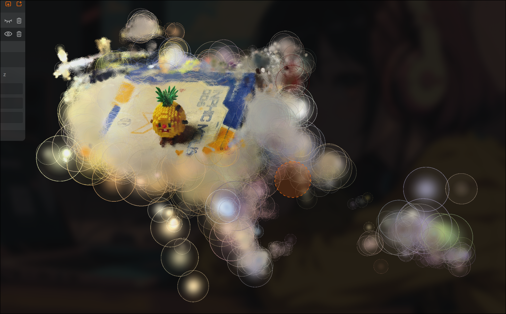

# 第一次学习记录
  今天去修电脑放一天假
# 第二次学习记录
  先学习相关内容后，对高斯点的各向异性入手
  从颜色和形状的各向异性进行修改高斯点的模型
  完成高斯点向无人机的趋向

  

  修改的代码会上传到git库上
  对原先代码有了优化：训练参数少了两个
  减少了两个基本函数的使用（到时候可以删掉）


新问题：高斯点太亮->会出现无人机无法表示的现象

下一步：限制数量看看效果如何


# 第三次学习记录
今天着手限制高斯点数量
但是感觉比较棘手因为会出现两种情况
我在想有有下面两种情况

1.初始化的点就已经很多了，直接超过预设的高斯点数量

2.在分裂和克隆的时候，增加出的高斯点数量

关于第一个点打算使用下采样

关于第二点我的想法是，先把需要克隆或者分裂的高斯点的平均梯度进行排序，然后梯度越大的先进行分裂和克隆，如果期间等于预订的数量那么就不进行分裂和克隆了

```python
def create_from_pcd(self, pcd : BasicPointCloud, cam_infos: list, spatial_lr_scale: float, max_gaussians=-1):
    self.spatial_lr_scale = spatial_lr_scale
    fused_point_cloud = torch.tensor(np.asarray(pcd.points)).float().cuda()
    fused_color_SH = RGB2SH(torch.tensor(np.asarray(pcd.colors)).float().cuda())
    fused_color = torch.tensor(np.asarray(pcd.colors)).float().cuda() # 保留原始颜色用于下采样

    # 如果初始点数超过上限，则进行体素下采样
    if max_gaussians != -1 and fused_point_cloud.shape[0] > max_gaussians:
        print(f"Initial points {fused_point_cloud.shape[0]} exceed max_gaussians {max_gaussians}. Applying Voxel Grid Downsampling...")

        # 动态计算 voxel_size
        # 1. 估算场景包围盒的体积
        # scene.cameras_extent 是一个不错的场景范围估计值
        scene_extent = self.spatial_lr_scale # 这个参数通常与场景范围有关
        scene_volume = scene_extent ** 3

        # 2. 计算每个体素的目标体积
        num_points = fused_point_cloud.shape[0]
        # 我们希望采样后的点数约等于 max_gaussians
        # 实际非空体素数会小于总点数，所以我们用一个比例因子来调整
        # 这个比例可以根据经验设置，例如0.5
        target_voxels = max_gaussians 
        voxel_volume = scene_volume / target_voxels
        
        # 3. 计算体素边长
        voxel_size = voxel_volume ** (1/3)
        print(f"Dynamically calculated voxel_size: {voxel_size:.4f}")

        # 执行下采样
        original_points = fused_point_cloud
        original_colors_sh = fused_color_SH
        
        # 我们对原始点云进行下采样，然后用得到的索引去筛选SH系数和颜色
        _, first_indices_np = np.unique((original_points / voxel_size).floor().int().cpu().numpy(), axis=0, return_index=True)
        first_indices = torch.from_numpy(first_indices_np).to(original_points.device).long()

        fused_point_cloud = original_points[first_indices]
        fused_color_SH = original_colors_sh[first_indices]

        print(f"Downsampled to {fused_point_cloud.shape[0]} points.")

    features = torch.zeros((fused_color_SH.shape[0], 3, (self.max_sh_degree + 1) ** 2)).float().cuda()
    features[:, :3, 0] = fused_color_SH
    features[:, 3:, 1:] = 0.0
```


```python
def voxel_grid_downsample_pytorch(points, colors, voxel_size):
    """
    使用PyTorch对点云进行体素网格下采样。
    
    参数:
    - points (torch.Tensor): 原始点云坐标，形状为 (N, 3)。
    - colors (torch.Tensor): 原始点云颜色，形状为 (N, C)，C为颜色通道数。
    - voxel_size (float): 体素（小立方体）的边长。
    
    返回:
    - (torch.Tensor, torch.Tensor): 下采样后的点云坐标和颜色。
    """
    # 1. 计算每个点所在的体素索引
    # 通过将坐标除以体素大小并取整，得到离散的体素索引
    voxel_indices = torch.floor(points / voxel_size).int()

    # 2. 找到唯一的体素索引及其在原数组中的首次出现位置
    # 我们利用 torch.unique 来识别所有非空的体素，并获取每个唯一体素的第一个点的索引
    # Pytorch的 unique 对于多维数组的处理非常高效
    unique_voxel_indices, first_occurrence_indices = torch.unique(voxel_indices, dim=0, return_inverse=False, return_counts=False, return_output=True)
    # first_occurrence_indices 在一些torch版本中可能不直接返回，这里用unique_voxel_indices的索引来模拟
    
    # 一个更健壮的获取首次出现索引的方法
    # 创建一个唯一键来标识每个体素
    # 注：为了避免哈希冲突，这里的系数应该是足够大的质数，且与体素网格的最大范围有关。
    # 为简单起见，我们使用一个更通用的方法。
    _, inverse_indices = torch.unique(voxel_indices, dim=0, return_inverse=True)
    
    # `torch.unique` 不直接返回首次出现位置，但我们可以用 numpy 来轻松实现
    # 这会有一个短暂的 CPU-GPU 数据同步，但对于一次性初始化操作来说，开销可以忽略
    _, first_indices_np = np.unique(inverse_indices.cpu().numpy(), return_index=True)
    first_indices = torch.from_numpy(first_indices_np).to(points.device).long()

    # 3. 使用这些索引来筛选出代表点
    downsampled_points = points[first_indices]
    downsampled_colors = colors[first_indices]

    return downsampled_points, downsampled_colors
```
